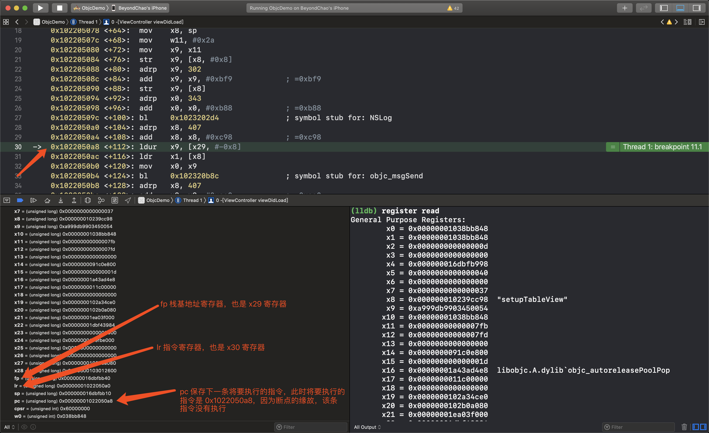
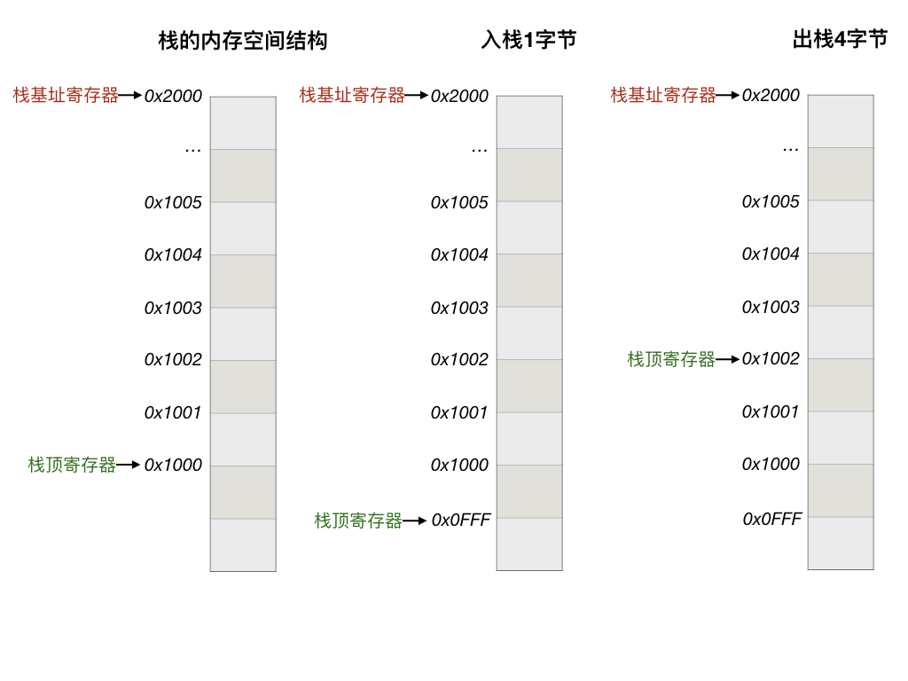
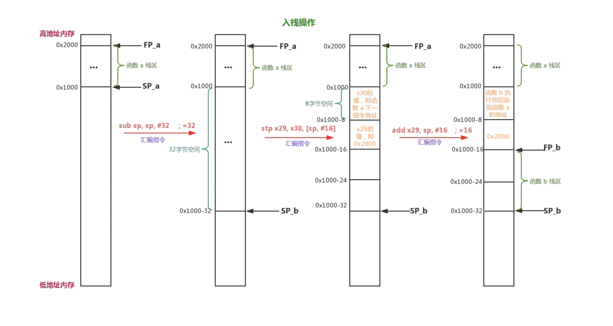
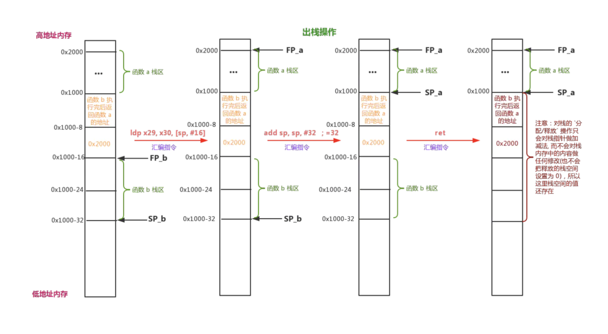
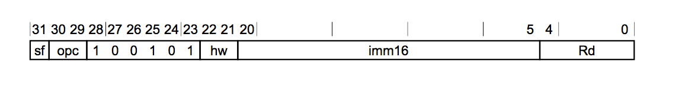

# AssemblyJourney
ARM64 architecture instruction 

arm64 汇编菜鸟的私房菜。

---

## About ARM （Acron RISC Machine | Advanced RISC Machines）

> 更多关于 ARM 架构、公司 参见这篇科普 [ARM到底是一家什么样的公司](https://www.ithome.com/0/424/726.htm)

> [ARM architecture](https://en.wikipedia.org/wiki/ARM_architecture#64/32-bit_architecture)

> 关于苹果设计的一些芯片，架构，手机等信息，参见 [List of Apple processors](https://en.wikipedia.org/wiki/Apple-designed_processors#List_of_Apple_processors) 

---

## Generate assembly code

```
clang -S -arch arm64 -isysroot `xcrun --sdk iphoneos --show-sdk-path` YOUR_SOURCE_FILE.c -o ./asm/YOUR_ASSEMBLY_FILE.s

```

* -arch 指定架构平台
* -isysroot 指定SDK 的目录（include 头文件所在库的位置），由 xcrun 生成的目录

---

## Register

|  寄存器   |   说明    |
|  --------   | --------  |
| **PC**  |  Program Counter 指令寄存器(程序计数器)，保存的是下一条将要执行的指令的内存地址，而不是当前正在执行的指令的内存地址。|
| **LR**  |  Link Register 寄存器则保存着最后一次函数调用指令的下一条指令的内存地址，为了做函数调用栈跟踪，我们的程序在崩溃时能够将函数调用栈打印出来就是借助了LR寄存器来实现的，在iOS 也就是 **X30 寄存器** |
| **SP** | Stack Pointer register **栈寄存器**，维护一个栈，需要两个寄存器，一个保存栈的基地址，也是**栈顶地址**，一个保存栈的偏移地址，即**栈底地址**，在 arm64 中**用 X29(FP) 寄存器保存栈的基地址，SP 寄存器 保存栈顶地址**，它是可以移动的，在现代几乎所有的机器中，**栈都是从高地址向低地址生长的**，所以我们看到函数的调用时候，通常第一句 都是 **sub sp, sp, #immediate，开辟栈空间，函数调用结束，add sp, sp, #immediate，回复栈空间**，这也是为什么，栈内存能够自动回收的原因 |
| **X0-X30** | **数据地址寄存器**通常用来做数据计算的临时存储、做累加、计数、地址保存等功能, 对应的32位是**W0-W30** |
| **XZR** | 用来保存 0，它的 32 位是 **WZR**，一般定义一个变量，初始化为 0 时就会用到它 |
| **D0-D31** | **浮点寄存器**，因为浮点数的存储以及其运算的特殊性，所以CPU中专门提供 **[FPU](https://en.wikipedia.org/wiki/Floating-point_unit)（Float Point Unit CPU 中的浮点运算单元）** 以及相应的浮点数寄存器来处理浮点数，对应的 32位是 **S0 - S31** |
| **V0-V31** | 现在的CPU除了支持标量运算外，还支持向量运算。向量运算在图形处理相关的领域用得非常的多。为了支持向量计算系统了也提供了众多的**向量寄存器**|
|**CPSR**| **状态寄存器**，1. 保存指令执行过程中的结果，比如相加的结果是否溢出、结果是否为0、以及是否是负数等。2. 一些指令的执行需要根据状态寄存器的值进行处理，比如一些条件跳转指令或者比较指令等|

**注意：**
> 1. arm64体系的CPU中虽然定义X29,X30两个寄存器，但是你在 Xcode 上是看不到这两个寄存器的，但是你能到FP和LR寄存器，其实 **X29就是FP, X30就是LR。**
> 2. 关于栈为什么是向下生长的？详见 [why-does-the-stack-grow-downward](https://softwareengineering.stackexchange.com/questions/137640/why-does-the-stack-grow-downward)

**Xcode** 查看真机上的寄存器如图：



## 关于栈的结构和操作

1. 栈结构图：



2. 入栈


3. 出栈



--- 

## Instructions

常用指令介绍

|  指令     | 使用示例    | 说明 |
|  --------   | --------  | ------- | 
| **stp**  |  sub sp, sp, #32 <br> stp x29, x30, [sp, #16] | stp: Store Pair of Registers 把一对寄存器中的内容保存起来。<br>通常是保存到栈上或内存中，这里是把 FP LR 保存到sp 偏移16字节的位置上。<br> 这两句一般出现在函数的开头（*prologue*），用于开辟栈空间，保存现场，因为寄存器在CPU中只有一个，调用别的函数时也需要使用的。<br> 所以这一句是保存函数调用前的栈顶寄存器的值和该函数返回后下一个将要执行的指令地址值 <br> 所以先把相关寄存器的内容保存到栈内存中，当执行完毕后，从栈中 **ldp** 加载之前保存的内容到寄存器中，恢复现场（*epilogue*），**ret** 就是把 LR 内容赋值给 PC |
|**adrp**|  adrp x0, l_.str@PAGE  <br> add x0, x0, l_.str@PAGEOFF <br> bl	_printf | 获取某个标签所在页的地址，这里的label 是 l_.str <br>@PAGE 表示该标签所在的页 <br> @PAGEOFF 表示该标签地址对应页地址的偏移<br>这样 add 之后 就可以获取某个标签具体的地址了 <br>（保存着字符串常量），把计算结果存入**x0 寄存器**，<br> 然后调用 printf 打印出来，因为 x0 保存的是函数调用的第一个参数。|
| **br** | nop <br> ldr x16, 0x1640 <br> br x16 | 函数调用指令（调整指令）这段指令一般用在 _stub 函数的开头，这里跳转指令不用 **blr**而用 **br**的原因是如果采用**blr**则将会再次形成一个调用栈的生成，这样在调试和断点时看到的将不是真实的函数调用，iOS系统中一个程序中的所有**_stub**函数的符号和实现分别存放在代码段__TEXT的**_stubs**和**_stub_helper**两个section中。
| **b** |  | 函数调用指令 |

> 1. 更多指令详解介绍，参照 arm64(armV8) [指令手册](media/DDI_0596_ARM_a64_instruction_set_architecture.pdf)，[armasm 用户指南](media/DUI0801I_armasm_user_guide.pdf)，方便查阅。 <br>
> 2. armasm: The  ARM  Assembler  compiles  ARM  Assembly Language into
       object code in ARM Object Format
> 3. [arm官网文档](http://infocenter.arm.com/help/index.jsp?topic=/com.arm.doc.dui0802a/a64_general_instructions.html)

---

## ARM64 Call Convention

### 1. 常规参数

a. 如果函数没有参数，则出来函数调用，则不作处理

b. 如果函数的参数个数 <=8个， 参数传递将按照从左往右的定义的顺序依次保存到X0 - X7 这8个寄存器中

c. 如果参数的个数>8个，那么超过数量部分的参数，将会按从右往左的顺序依次压入到栈中

d. 如果参数的类型是小于8个字节的情况下，则前8个参数会分别保存在对应的32位或者16位或者8位寄存器中


### 2. 浮点参数

系统提供32个128位的浮点寄存器Q0-Q31(V0-V31)，其中的低64位则被称为D0-D31，其中的低32位则被称为 **S0-S31**，其中的低16位则被称为**H0-H31**,其中的低8位则被称之为**B0-B31**。 也就是说单精度浮点保存到S开头的寄存器, 双精度浮点保存到D开头的寄存器


a. 如果浮点数参数的个数<=8个，那么参数传递将按从左往右的顺序依次保存到 D0-D7或者S0-S7 这8个寄存器中

b. 如果浮点数参数个数>8个时，那么超过数量部分的参数，将会按从右往左的顺序依次压入到栈中

c. 如果函数参数中既有浮点也有常规参数那么保存到寄存器中的顺序和规则不会相互影响

---

### 3. 结构体参数

针对结构体类型的参数，需要考虑结构体的尺寸以及数据类型和数量。这里的结构体的尺寸分别是考虑小于等于8字节，小于等于16字节，大于16字节。而结构体成员类型则分为：全部都是非浮点数据成员、全部都是浮点数成员(这里会区分单精度和双精度)、以及混合类型的成员(如果结构体中有单精度和双精度都算混合)。下面是针对结构体参数的规则：

a. 如果数据成员全部都是非浮点数据成员则 如果尺寸<=8则会将值保存到X0-X8中的某一个寄存器中， 如果尺寸<=16则会将值保存到X0-X8中的某两个连续的寄存器中，如果尺寸>16则结构体将不再按值传递而是以指针的形式进行传递并保存到X0-X8中的某一个寄存器中。

b. 如果数据成员全部都是单精度浮点成员则如果成员数量<=4则会将数据成员保存到S0-S7中的某4个连续的浮点寄存器中,如果数量>4则结构体将不再按值传递而是以指针的形式进行传递并保存到X0-X8中的某一个寄存器中。

c. 如果数据成员全部都是双精度浮点成员则如果成员数量<=4则会将数据成员保存到D0-D7中的某4个连续的浮点寄存器中,如果数量>4则结构体将不再按值传递而是以指针的形式进行传递并保存到X0-X8中的某一个寄存器中。

d. 如果数据成员是混合类型的则如果尺寸<=8则保存到X0-X8中的某一个寄存器中，如果尺寸<=16则保存到X0-X8中的某两个连续的寄存器中, 如果尺寸>16则结构体将不再按值传递而是以指针的形式进行传递并保存到X0-X8中的某一个寄存器中。

e. 因为结构体参数的寄存器规则会影响到上述非结构体参数的传递规则，因此一定程度上可以将结构体当做多个参数传递来看待。

下面演示几个结构体定义以及返回结构体的函数：

```
//长度<=8个字节的结构体
struct S1
{
    char a;
    char b;
    int c;
};

//长度<=16的单精度浮点结构体
struct S2
{
   float a;
   float b;
   float c;
};

//长度<=16的混合结构体
struct S3
{
  int a;
  int b;
  double c;
};

//长度>16个字节的结构体
struct S4
{
   long a;
   long b;
   double c;
}

 //函数签名
 void foo8(struct S1);
 void foo9(struct S2);
 void foo10(struct S3);
 void foo11(struct S4);


//高级语言的函数调用以及对应的机器指令伪代码实现
struct S1 s1;
struct S2 s2;
struct S3 s3;
struct S4 s4;
foo8(s1)  <==>  X0= s1.a | (s1.b <<8) | (s1.c << 32), bl foo8
foo9(s2)  <==> S0 = s2.a, S1 = s2.b, S3 = s2.c  bl foo9
foo10(s3) <==>  X0 = s3.a | (s3.b << 32), X1 = s3.c, bl foo10
foo11(s4) <==>  X0 = &s4, bl foo11

```

### 4. 可变参数

可变参数函数因为其参数的类型和参数的数量不固定，所以系统在编译时会根据函数调用时传递的参数的值类型而进行不同的处理

 a. 函数调用时会根据传递的参数的数量和类型来决定，其中**明确类型的部分按照上面介绍的规则进行传递**，而**可变部分则从右往左依次压入到堆栈中**


```
//函数签名
void foo7(int a, ...);

//高级语言的函数调用以及对应的机器指令伪代码实现，参数 a 因为有明确的类型，所以作为第一个参数通过X0 传递，可变部分从右往左压栈
foo7(10, 20, 30.0, 40)  <==> X0 = 10,   SP-=8,  *SP = 40,  SP-=8,  *SP = 30.0,  SP-=8,  *SP = 20, bl foo7

```


### 5. 函数返回值

#### 5.1 常规类型返回
a. 函数的返回参数保存到X0寄存器上

#### 5.2 浮点类型返回
a. 单精度浮点返回保存到S0，双精度浮点返回保存到D0

#### 5.3 结构体返回

针对结构体类型的参数，需要考虑结构体中的成员的数据类型以及整体结构体的尺寸。这里的结构体的尺寸分别是考虑小于等于8字节，小于等于16字节，大于16字节。而结构体成员类型则分为：全部都是非浮点数据成员、全部都是浮点数成员(这里会区分单精度和双精度)、以及混合类型的成员(如果结构体中有单精度和双精度都算混合)。这样一共分为9种情,下面就是针对结构体类型返回的规则：

a：针对非浮点数据成员的结构体来说如果结构体的尺寸<=8，那么结构体的值会保存到X0, 如果尺寸<=16，那么保存到X0,X1中，如果尺寸>16则结构体返回会保存到X8寄存器所指向的内存中，也就是X8寄存器比较特殊，专门用来保存返回的结构体的指针。

b: 如果结构体的成员都是单精度并且数量<=4 则返回结构体的每个成员分别保存到S0,S1,S2, S3四个寄存中,如果结构体成员数量超过4个则结构体返回会保存到X8寄存器所指向的内存中。

c: 如果结构体的成员都是双精度并且数量<=4 则返回结构体的每个成员分别保存到D0,D1,D2,D3四个寄存器中，如果结构体成员数量超过4个则结构体返回会保存到X8寄存器所指向的内存中。

d: 如果结构体是混合型数据成员，并且结构体的尺寸<=8字节，那么结构体的值保存到X0， 如果尺寸<=16字节则保存到X0,X1中，如果尺寸>16则结构体返回会保存到X8寄存器所指向的内存中。


下面演示几个结构体定义以及返回结构体的函数：

```
//长度为16字节的结构体
struct S1
{
   char a;
   char b;
   double c;
};

 //长度超过16字节的混合成员结构体
struct S2
{
   int a;
   int b;
   int c;
   double d;
};

//长度小于等于8字节的结构体
struct S3
{
   int a;
   int b;
};


CGRect  foo1()
{
      //高级语言实现的返回
      return CGRectMake(10,20,30,40);
     //机器指令的函数返回的伪代码如下：
    /* 
      D0 = 10
      D1 = 20
      D2 = 30
      D3 = 40
     ret
     */
}

struct S1 foo2()
{
    //高级语言实现的返回
    return (struct S1){10, 20, 30};
   //机器指令的函数返回的伪代码如下：
    /* 
      X0 = 10 |  20 << 8
      X1 = 30
     ret
     */

}

struct S2 foo3()
{
   //高级语言实现的返回
   return (struct S2){10, 20, 30, 40};
  //机器指令的函数返回的伪代码如下：
  /*
     struct S2 *p = X8     //X8中保存返回的结构体内存地址
     p->a = 10
     p->b = 20
     p->c = 30
     p->d = 40
     ret
  */
  
}

struct S3 foo4()
{
   //高级语言实现的返回
   return (struct S3){20, 30};
  //机器指令的函数返回的伪代码如下：
  /*
        X0 = 20 | 30 << 32
        ret
  */
}

```

## Assembly Syntax

1. CFI (Call Frame Information)
   
   a. .cfi_startproc 

   b. .cfi_def_cfa

   c. .cfi_offset
   
   d. .cfi_def_cfa_offset
   
   e. .cfi_endproc

## Instruction encodings

我们知道机器指令是二进制数据，最终一条指令（汇编指令）被翻译成机器码才能执行的，一条机器指令里面无论是操作码还是操作数都是二进制编码的，二进制数据太过晦涩难以理解，所以才有了汇编语言的诞生，汇编语言是一种机器指令的助记语言，他只不过是以人类更容易理解的自然语言的方式来描述一条机器指令而已。所以虽然上面的寄存器看到的是一个个字母，但是在机器语言里面，则是通过给寄存器编号来表示某个寄存器的


```
汇编指令与其对应的机器码：

mov x0, #0x0     ;0xD2800000  
mov x1, #0x0     ;0xD2800001
mov x2, #0x0     ;0xD2800002

```

mov 指令编码为


* Rd 段表示寄存器的编码，CPU 在访问寄存器的时候，就是根据这个段来标识要访问那个寄存器，理解为寄存器的地址，和CPU 访问内存单元类似
* imm16 段表示要操作的立即数
* hw 段
* sf 段
* opc 段表示 操作码


---

## Reference
* https://zhuanlan.zhihu.com/p/31168191
* https://www.jianshu.com/p/f649285668cd
* https://www.jianshu.com/p/6d7a57794122